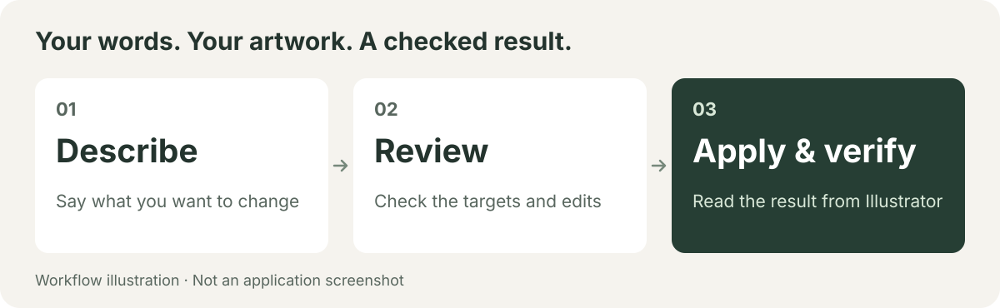

# Illustrator Studio MCP

[](LICENSE)     [](https://www.npmjs.com/package/illustrator-studio-mcp)

**Public Beta — 0.1.0-beta.4.** A trial release, not production-ready. Try it on a copy of your artwork.

> **Requirement: keep Illustrator in the foreground with the screen unlocked.** Continuous editing of saved files (edit sessions), export, and many other operations are verified only in this state. In the background or with the screen locked, operations are refused or fail with an unclear reason.


[日本語](README.md) | **English**

**Plan, apply, and check Illustrator work with an AI assistant.**

Ask a compatible AI app such as Claude Code to replace a headline, align shapes, or swap a photo. MCP is the connection between that app and Illustrator.

The tool identifies what will change, checks the target again immediately before writing, and reads the result back from Illustrator. If a response is lost and the outcome is unclear, it stops further edits.

**Public Beta 0.1.0-beta.4. Mac only.** Distributed through the [npm `beta` tag](https://www.npmjs.com/package/illustrator-studio-mcp) and a [GitHub prerelease](https://github.com/mhimt-lab/illustrator-studio-mcp/releases/tag/v0.1.0-beta.4).

[84 MCP tools](docs/tools.en.md) · [Verified per operation on Illustrator 30.8.x](docs/compatibility.en.md)

[What you can do](#what-you-can-do) · [Beta scope](#beta-scope) · [Try it](#quick-start) · [How changes are checked](#how-changes-are-checked) · [Verification and limitations](#verification-and-limitations)

<picture>
  <source media="(max-width: 600px)" srcset="docs/images/readme-workflow-en-mobile.svg">
  
</picture>

## What you can do

| A request from your workflow | Supported work and conditions |
| --- | --- |
| “Replace this headline.” | Replace supported single-line point text directly on a layer, preserving the supported formatting |
| “Space these shapes evenly.” | Align, distribute, and reorder supported paths |
| “Move this group of text and photos together.” | Check and translate supported text, paths, and linked images inside a group. Group scaling and rotation are excluded |
| “Swap this photo for the latest version.” | Relink an image with identical pixel dimensions, checking position, size, and stacking order |
| “Check the fonts and anything that needs attention before print.” | Read fonts, image links, resolution, and other supported properties, reporting incomplete checks too |

Supported functions by type of work:

| Work | Summary of functions |
| --- | --- |
| Inspect | Read documents, layers, selections, text, images, and colors |
| Refine text | Create point and area text; targeted replacement, fonts, formatting, text orientation, and columns |
| Create and arrange | Create shapes and curves; edit paths; move, align, duplicate, and group; conditional clipping masks, compound paths, and Pathfinder (in CMYK documents, compound-path creation is unsupported and stacking-order changes support bring-to-front only) |
| Work with color | Path fill and stroke; RGB/CMYK process swatches; spot colors and gradients in RGB documents; color search and replacement planning |
| Work with images | Place and relink linked images; embedding (JPEG/PNG in RGB documents only); downsampling on a working copy |
| Documents and layers | Edit layers; create, open, close, and save documents; continuous editing of saved files (experimental) |
| Batch work | Batch replacement, multiple edits in one request, and planning and running saved recipes |
| Check and recover | Print preflight, structure diffs, previews, comparison of existing PNGs, verified backups, outlined export to new AI/PDF files, and reconciliation after unknown outcomes |

Conditions differ by operation: see [Verification and limitations](#verification-and-limitations) and the [tool catalog](docs/tools.en.md). The number of available functions does not mean every input or environment has been verified. For example requests, see [Usage and examples](docs/usage.en.md).

## Beta scope

| Area | Details |
| --- | --- |
| In scope | Reading and inspection; non-destructive edits of supported shapes, text, and images (including CMYK documents); continuous editing of saved files (edit sessions, experimental); backup and overwrite save; outlined AI/PDF export; PNG/JPEG export of one artboard (RGB documents, scale 1 or 2, never overwriting an existing file); placing, relinking, embedding (JPEG/PNG in RGB documents only), and optimizing images; stdio transport (MCP 2026-07-28) |
| Out of scope | SVG export, artboard removal and Web pixel profiles, paragraph styles, MCP Tasks, Windows, deleting several objects at once (one object per delete), missing-link repair, ungrouping |
| Streamable HTTP | Covered by automated tests and client connection checks only. No Illustrator operation over HTTP has been recorded. Loopback (`127.0.0.1`) only; not for external exposure |
| CMYK documents | Stacking-order changes support bring-to-front (`front`) only. Creating compound paths is not supported (refused) |
| Known intermittent issue | Reading groups can intermittently lose the reference to an item. The operation then stops on the safe side (fails closed) instead of guessing. It is not hidden by retries, and restarting Illustrator is not guaranteed to fix it |
| CI | The release candidate source passed the full test suite on macOS CI and locally. This describes the frozen distribution, separately from later CI results |

## How changes are checked

1. **Plan** — Identify the document, objects, and proposed edits.
2. **Check immediately before writing** — Confirm that the target still matches the plan.
3. **Apply** — Perform the approved change and retain an execution record to prevent duplicate application.
4. **Verify** — Read text, positions, colors, and other relevant values back from Illustrator and compare them with the plan.
5. **Reconcile or recover when needed** — Follow the operation's state-checking or restoration procedure. Stop when the outcome is unknown; do not guess that recovery succeeded.

Editing operations separate planning from applying. Opening, saving, and backing up a document use different call patterns. Review what your AI app proposes to execute before proceeding.

**“Verified” means the values checked by that operation matched the plan.** It does not guarantee complete document restoration, every appearance effect, visual quality, or print readiness. Inspect the result in Illustrator. See [Safety](docs/safety.en.md) for details, and the [recovery steps](docs/runbook.en.md) if an operation stops.

## Quick Start

### 1. Prepare your Mac

You need a Mac, stable Adobe Illustrator, Node.js 20 or newer, and a compatible AI app that can launch local tools. Node.js runs this tool. The server needs no API key; your AI app's terms and fees are separate.

In Terminal, run:

```bash
npm install -g illustrator-studio-mcp@beta
illustrator-studio-mcp --version
```

The second command should print `0.1.0-beta.4`. Always include `@beta`: a plain `npm install illustrator-studio-mcp` uses the `latest` tag, which may not be this version. You can also install from the distribution file (`.tgz`) attached to the GitHub prerelease. For updating and uninstalling, see [Install](docs/install.en.md). For Claude Desktop, you can open the Desktop extension (`.mcpb`) from the prerelease and install it; the npm install above is then not needed ([steps](docs/install.en.md#claude-desktop)).

### 2. Connect your AI app

For Claude Code, run this in Terminal, then restart the app:

```bash
claude mcp add --transport stdio illustrator-studio -- illustrator-studio-mcp
```

To launch without a global install, use `npx -y illustrator-studio-mcp@beta`. Your AI app launches this command and connects over stdio. `@beta` follows future Beta updates; use `@0.1.0-beta.4` to pin this version.

Other AI apps (Claude Desktop, Codex CLI, ChatGPT Work Local) use different settings. See [connection examples](docs/install.en.md#register-the-installed-command). A successful connection test is separate from completing production work through that app.

### 3. Start without changing a document

Open a test document in stable Illustrator, bring it to the foreground, and unlock the screen. Check the required environment in Terminal:

```bash
illustrator-studio-mcp doctor
```

This does not edit the document. If macOS asks permission to control Illustrator, review and allow the request. Skipped or unknown checks do not establish a working connection; see [the diagnostic guide](docs/setup.en.md#doctor).

In your AI app's conversation, enter this. You do not need to write code or know tool names:

```text
Tell me which documents are open in Illustrator and which text or shapes are selected.
Only look. Do not change, save, or export anything.
```

Compare the answer with Illustrator. “No selection” is valid when nothing is selected.

### 4. Ask for a proposed edit

Select one line of point text outside a group. Point text is created by clicking with the Type tool, rather than dragging a text box.

```text
I'd like to change the selected headline to “Weekend Special”, keeping its size and color.
Show me what you would change and where. Do not change or save anything yet.
If its formatting is unsupported, tell me why.
```

Check the target and proposed text before asking the AI to apply it. See [Usage and examples](docs/usage.en.md) for requests that replace several text frames or photos, and the [tool catalog](docs/tools.en.md) for other tasks and tool identifiers.

## Verification and limitations

Recent live checks used macOS 27.0 and stable Illustrator 30.8.1, foreground and unlocked. RGB and CMYK test documents each completed 103 consecutive changes and 108 total changes including recovery checks. There are 45 major execution records, supplemented by new measurements for operations whose code subsequently changed.

These are bounded tests through a dedicated connection program. They do not establish arbitrary artwork support, every AI app, or long-running production use. Do not extend the results to Illustrator Beta, background operation, or a locked screen.

| Limitation | Current state |
| --- | --- |
| Reading groups | Known intermittent issue: a group reference can become unreadable, and the operation then stops on the safe side (fails closed). The cause is unresolved; restarting Illustrator is not an established repair |
| Long document identifiers | Long information identifying a document, including its path, can make a saved execution record unreadable. Replay and recovery are not guaranteed for arbitrary documents |
| Continuous editing | With a verified backup and exclusive document use, 36 editing operations are supported. Delete, embed, vector import and artboard updates are excluded. The backup a session needs stops at 1,000 items (one 1,000-item live run took about 18.3 s), so that is the effective session ceiling. Performance, finished-record retention, and recovery usability remain unfinished |
| Stroke after saving text | Newly created point text acquiring a stroke after save was corrected and rechecked in RGB/CMYK. Existing stroked text remains unsupported |
| Character-style restoration | An incorrect restoration result was corrected. Forcing a failure through the actual tool and completing live rollback remains unverified |
| Unsupported work | Path text, paragraph-style mutation, ungrouping, missing-link repair, and outlining in the original document, among other limits |

If a response stops, do not bypass it by sending the edit as a new request or deleting execution records. See [client verification](docs/compatibility.en.md) and [recovery steps](docs/runbook.en.md).

## Documentation

| 文書 / Document | 日本語 | English |
| --- | --- | --- |
| 使い方・依頼例 / Usage | [日本語](docs/usage.md) | [English](docs/usage.en.md) |
| 導入 / Installation | [日本語](docs/install.md) | [English](docs/install.en.md) |
| 接続・診断 / Setup | [日本語](docs/setup.md) | [English](docs/setup.en.md) |
| 安全の仕組み / Safety | [日本語](docs/safety.md) | [English](docs/safety.en.md) |
| 復旧 / Recovery | [日本語](docs/runbook.md) | [English](docs/runbook.en.md) |
| 互換性 / Compatibility | [日本語](docs/compatibility.md) | [English](docs/compatibility.en.md) |
| ツール / Tools | [日本語](docs/tools.md) | [English](docs/tools.en.md) |
| 変更履歴 / Changelog | [日本語](CHANGELOG.md) | [English](CHANGELOG.en.md) |
| リリースノート / Release notes | [日本語](RELEASE_NOTES.md) | [English](RELEASE_NOTES.en.md) |
| セキュリティ / Security | [日本語](SECURITY.ja.md) | [English](SECURITY.md) |
| サポート / Support | [日本語](SUPPORT.ja.md) | [English](SUPPORT.md) |
| 行動規範 / Conduct | [日本語](CODE_OF_CONDUCT.ja.md) | [English](CODE_OF_CONDUCT.md) |
| 貢献 / Contributing | [日本語](CONTRIBUTING.md) | [English](CONTRIBUTING.en.md) |
| ライセンス / License | [日本語](LICENSE.ja.md) | [English](LICENSE.en.md) |

See [Install](docs/install.en.md), [connection settings](docs/setup.en.md), and [recovery steps](docs/runbook.en.md). See the contact below. Do not post vulnerabilities or private materials in ordinary Issues.

## License

[Business Source License 1.1](LICENSE). The Additional Use Grant permits ordinary internal business use and design services where clients receive creative outputs. Providing a Competitive Offering to third parties is restricted. This is not an OSI-approved open source license. Read the full [LICENSE](LICENSE) for its terms.

Illustrator Studio MCP is an independent project, not an Adobe product. It is not affiliated with, endorsed by, or sponsored by Adobe. Adobe and Illustrator are either registered trademarks or trademarks of Adobe in the United States and/or other countries.

<details>
<summary>Connection reference: tool identifiers (not needed for everyday requests)</summary>

`illustrator_align_objects`, `illustrator_apply_character_style`, `illustrator_apply_pathfinder`, `illustrator_capture_preview`, `illustrator_capture_structure_snapshot`, `illustrator_check_contrast`, `illustrator_check_text_consistency`, `illustrator_close_document`, `illustrator_close_edit_session`, `illustrator_compare_images`, `illustrator_create_area_text`, `illustrator_create_backup`, `illustrator_create_batch`, `illustrator_create_character_style`, `illustrator_create_clipping_mask`, `illustrator_create_document`, `illustrator_create_layer`, `illustrator_create_point_text`, `illustrator_create_rectangle`, `illustrator_create_shape`, `illustrator_create_swatch_resource`, `illustrator_delete_objects`, `illustrator_diff_structure`, `illustrator_duplicate_object`, `illustrator_edit_path_points`, `illustrator_embed_image`, `illustrator_export`, `illustrator_export_outlined`, `illustrator_extract_design_tokens`, `illustrator_find_color_usages`, `illustrator_find_fonts`, `illustrator_get_area_text_options`, `illustrator_get_context`, `illustrator_get_edit_session`, `illustrator_get_object`, `illustrator_get_path_points`, `illustrator_group_objects`, `illustrator_import_vector_artwork`, `illustrator_list_documents`, `illustrator_list_layers`, `illustrator_list_objects`, `illustrator_list_recipes`, `illustrator_list_selection`, `illustrator_list_swatches`, `illustrator_list_text_styles`, `illustrator_make_compound_path`, `illustrator_move_object_to_layer`, `illustrator_mutate_batch`, `illustrator_open_document`, `illustrator_open_edit_session`, `illustrator_optimize_images`, `illustrator_place_image`, `illustrator_plan_color_replacement`, `illustrator_plan_recipe`, `illustrator_preflight_images`, `illustrator_preflight_print`, `illustrator_read_structure_diff`, `illustrator_reconcile`, `illustrator_reconcile_backup`, `illustrator_reconcile_delete`, `illustrator_reconcile_export`, `illustrator_release_clipping_mask`, `illustrator_relink_image`, `illustrator_reorder_layer`, `illustrator_replace_font`, `illustrator_replace_point_text`, `illustrator_replace_point_text_batch`, `illustrator_replace_text_range`, `illustrator_run_m6_appearance_preview_recipe`, `illustrator_run_recipe`, `illustrator_save_document`, `illustrator_save_document_as`, `illustrator_save_recipe`, `illustrator_set_area_text_columns`, `illustrator_set_layer_state`, `illustrator_set_no_break`, `illustrator_set_object_state`, `illustrator_set_path_appearance`, `illustrator_set_stacking_order`, `illustrator_set_text_orientation`, `illustrator_set_text_style`, `illustrator_transform_object`, `illustrator_update_artboard`, `illustrator_update_character_style`

</details>

## Contact

The approved maintainer identity is **mhimt**, with contact [sporks-framer9t@icloud.com](mailto:sporks-framer9t@icloud.com). Receipt of a test email has been confirmed. Handling procedures remain unverified, with no guaranteed response time. Keep vulnerabilities and private materials out of ordinary Issues; use [private vulnerability reporting](https://github.com/mhimt-lab/illustrator-studio-mcp/security/advisories/new), or send a redacted initial summary by email.

## Clients and transports

beta.4 is published only after this exact package was installed and checked in Claude Code, Claude Desktop (both the `.mcpb` Desktop extension and the configuration file), Codex CLI, and ChatGPT Work Local, from installation through rectangle plan, apply, verification, save, reopen, and read-back. In Codex CLI and ChatGPT Work Local, the client used the `next_call` returned by the plan and reached the applied edit without extra instructions. ChatGPT Work Cloud is not supported. [Client-specific and transport evidence](docs/compatibility.en.md) is recorded separately. Configuration examples alone do not make a client Supported. These checks cover bounded documents and operations; they do not guarantee arbitrary artwork or every failure path.

`illustrator_update_artboard` is experimental: existing-board rename, inactive integer-point rect updates, active switching and adding a named board. Save after adding (an active switch needs no save). This server has no way to remove an added board. The live product-path check passed for rename, move and resize with their inverses, adding, and an active switch and its inverse.
