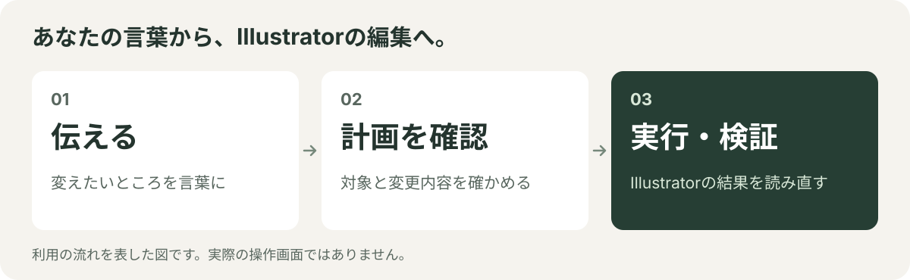

# Illustrator Studio MCP

[](LICENSE)     [](https://www.npmjs.com/package/illustrator-studio-mcp)

**Public Beta — 0.1.0-beta.4。** 試用版です。本番運用向けの完成版ではありません。制作ファイルのコピーで試してください。

> **前提: Illustratorを前面に表示し、画面ロックを解除した状態で使ってください。** 保存済みファイルの連続編集（edit session）や書き出しなど多くの操作は、この状態でだけ動作を確認しています。背面で動かしたり画面をロックしたりすると、操作が拒否されるか、理由の分かりにくい失敗になります。


**日本語** | [English](README.en.md)

**Illustratorの制作作業を、AIと相談しながら計画・実行・確認するためのツールです。**

見出しを差し替える、図形を揃える、写真を入れ替える。Claude Codeなどの対応AIアプリから、いつもの言葉で依頼できます。MCPは、AIアプリとIllustratorをつなぐ仕組みです。

特徴は、変更する場所と内容を先に示し、書き込む直前にも対象を確かめ、実行後にIllustratorから結果を読み直すこと。応答が途切れて結果が分からなくなった場合は、次の編集を止めます。

**Public Beta 0.1.0-beta.4。Mac専用です。** 配布は[npmのbetaタグ](https://www.npmjs.com/package/illustrator-studio-mcp)と[GitHubのprerelease](https://github.com/mhimt-lab/illustrator-studio-mcp/releases/tag/v0.1.0-beta.4)です。

[84のMCPツール](docs/tools.md) · [Illustrator 30.8.xで操作別に実機確認](docs/compatibility.md)

[できること](#できること) · [Betaの範囲](#betaの範囲) · [試してみる](#クイックスタート) · [安全の仕組み](#変更を確かめる仕組み) · [検証範囲と制約](#検証範囲と制約)

<picture>
  <source media="(max-width: 600px)" srcset="docs/images/readme-workflow-ja-mobile.svg">
  
</picture>

## できること

| 制作で頼みたいこと | 対応する作業と条件 |
| --- | --- |
| 「見出しだけを差し替えたい」 | レイヤー直下にある一行のポイント文字を、対応する書式を保って置換 |
| 「この図形を均等に並べたい」 | 対応するパスの整列・等間隔配置・前後関係の変更 |
| 「文字と写真を含むグループをまとめて動かしたい」 | 対象内の文字・図形・リンク画像を確認して移動。グループの拡縮・回転は対象外 |
| 「写真を最新版に入れ替えたい」 | 同じ画素寸法のリンク画像へ差し替え、位置・大きさ・重なり順を確認 |
| 「使われているフォントや印刷前の注意点を調べたい」 | フォント・画像リンク・解像度などを読み取り、未確認の項目も報告 |

作業の種類ごとに、対応している機能をまとめると次のとおりです。

| 作業 | 機能の要約 |
| --- | --- |
| 調べる | 文書・レイヤー・選択・文字・画像・色の読み取り |
| 文字を整える | ポイント文字・エリア内文字の作成、対象を限定した置換・フォント・書式・縦横組み・段組み |
| 作る・配置する | 図形・曲線の作成、パス編集、移動・整列・複製・グループ化、条件付きのマスク・複合パス・パスファインダー（CMYK文書では複合パスの作成に未対応、重なり順の変更は最前面だけ） |
| 色を扱う | パスの塗り・線、RGB／CMYKのプロセススウォッチ、RGB文書での特色・グラデーション、色の検索と置換計画 |
| 画像を扱う | リンク配置・差し替え、埋め込み（RGB文書のJPEG／PNGだけ）、作業コピー上での縮小 |
| 文書・レイヤーを扱う | レイヤー編集、文書の作成・開閉・保存、保存済みファイルの連続編集（experimental） |
| まとめて処理する | 一括置換、複数の編集、保存した手順（レシピ）の計画と実行 |
| 確認・回復する | 印刷前検査、構造差分、プレビュー、既存PNGの比較、検証済みバックアップ、新規AI／PDFへのアウトライン書き出し、結果不明時の照合 |

対応は作業ごとに異なります。[検証範囲と制約](#検証範囲と制約)と[ツール一覧](docs/tools.md)で確認できます。全入力・全環境の動作保証ではありません。依頼の書き方は[使い方と依頼例](docs/usage.md)にまとめています。

## Betaの範囲

| 区分 | 内容 |
| --- | --- |
| 対象 | 読み取り・検査、対応する図形・文字・画像の非破壊編集（CMYK文書を含む）、保存済みファイルの連続編集（edit session、experimental）、バックアップ・上書き保存、アウトライン化したAI／PDFの書き出し、アートボード1枚のPNG／JPEG書き出し（RGB文書、倍率1・2、既存ファイルは上書きしない）、画像の配置・リンク差し替え・埋め込み（RGB文書のJPEG／PNGだけ）・最適化、stdio接続（MCP 2026-07-28対応） |
| 対象外 | SVGの書き出し、アートボードの削除・Webピクセル指定、段落スタイル、MCP Tasks、Windows、複数オブジェクトの一括削除（削除は1回に1件）、リンク切れの修復、グループ解除 |
| Streamable HTTP | 自動テストとAIアプリとの接続確認までです。HTTP経由でIllustratorを操作した記録はありません。`127.0.0.1`専用で、外部公開はできません |
| CMYK文書の制限 | 重なり順の変更は最前面（`front`）だけ。複合パスの作成には未対応（拒否します） |
| 既知の間欠事象 | グループの読み取りで、ときどき対象を参照できなくなることがあります。このとき操作は安全側で止まり（fail closed）、推測で続行しません。再試行で隠さず、Illustratorの再起動で直るとも保証しません |
| CI | このリリースの公開候補のソースで、macOS上のCIとローカルの全体テストを通過しています。これは凍結した配布版の記録で、後続のCI結果とは区別します |

## 変更を確かめる仕組み

1. **計画する** — どの書類の、どの文字や図形を、どう変えるかを示します。
2. **直前に照合する** — 計画後に対象が変わっていないか、書き込む直前にも確かめます。
3. **実行する** — 確認した変更を適用し、同じ処理を重ねて実行しないための記録を残します。
4. **結果を読み直す** — Illustrator上の文字・位置・色などを、計画と比べます。
5. **必要なら復旧する** — 操作に応じて元へ戻す処理や状態確認へ進みます。結果が不明なら止め、復旧できたと推測しません。

編集操作は計画と実行を分けられます。書類を開く・保存する・バックアップを取る操作などは、同じ二段階方式ではありません。AIが提案する実行内容を確認してから進めてください。

**「検証済み」は、その操作が調べる値が計画と一致したという意味です。** 書類全体の完全復元、すべての効果や見た目、入稿品質を保証するものではありません。最後はIllustratorの画面で確認してください。詳しくは[安全の仕組み](docs/safety.md)、止まったときは[復旧手順](docs/runbook.md)を参照してください。

## クイックスタート

### 1. 動かすための準備

必要なのはMac、通常版のAdobe Illustrator、Node.js 20以上、Mac上のツールを起動できる対応AIアプリです。Node.jsは、このツールを動かすためのソフトです。AIアプリの利用条件・料金は別で、このツール自体のAPIキーは不要です。

Macの「ターミナル」で次の2行を実行します。

```bash
npm install -g illustrator-studio-mcp@beta
illustrator-studio-mcp --version
```

`0.1.0-beta.4`と表示されれば、インストールした版を確認できています。必ず `@beta` を付けてください（タグなしの `npm install illustrator-studio-mcp` は `latest` を使うため、この版になるとは限りません）。GitHubのprereleaseにある配布用ファイル（`.tgz`）からも導入できます。更新・削除は[導入ガイド](docs/install.md)にまとめています。Claude Desktopは、prereleaseのDesktop拡張（`.mcpb`）を開いてインストールできます。この場合、上のnpmのインストールは不要です（[手順](docs/install.md#claude-desktop)）。

### 2. AIアプリにつなぐ

Claude Codeでは、ターミナルで次を実行してからAIアプリを起動し直します。

```bash
claude mcp add --transport stdio illustrator-studio -- illustrator-studio-mcp
```

グローバルインストールなしで起動する場合は `npx -y illustrator-studio-mcp@beta` を使えます。AIアプリがこのコマンドを起動し、stdioで接続します。`@beta` は将来のBeta更新に追随するため、版を固定する場合は `@0.1.0-beta.4` と指定してください。

ほかのAIアプリ（Claude Desktop、Codex CLI、ChatGPT Work Local）では設定方法が異なります。[接続設定の例](docs/install.md#register-the-installed-command)を参照してください。アプリとの接続確認と、実際の制作作業が最後まで動くことの確認は別です。

### 3. 書類を変えずに試す

通常版のIllustratorを起動して前面に表示し、画面ロックを解除して、確認用の書類を開きます。ターミナルで接続に必要な環境を診断します。

```bash
illustrator-studio-mcp doctor
```

これは書類を編集しません。MacがIllustratorの操作許可を求めた場合は、内容を確認して許可します。「未実施」「結果不明」は接続成功ではありません。[診断](docs/setup.md#doctor)と[困ったときの案内](docs/runbook.md)を確認してください。

次に、AIアプリの会話欄へ次のように入力します。機能名やプログラムを書く必要はありません。

```text
Illustratorで開いている書類と、いま選択している文字や図形を教えて。
確認するだけにして、変更・保存・書き出しはしないで。
```

返答がIllustratorの画面と合っているか確かめます。何も選択していない場合は「選択なし」で正常です。

### 4. 変更案だけを見てみる

グループに入っていない一行のポイント文字を選びます。ポイント文字は、文字ツールでクリックして入力した文字です。ドラッグして枠を作るエリア内文字とは異なります。

```text
選択した見出しを「週末限定フェア」に変えたい。文字サイズと色はそのままにして。
まず対象と変更案を見せて。まだ変更・保存はしないで。
対応できない書式なら、その理由を教えて。
```

対象と内容に間違いがないことを確認してから、適用を依頼します。複数の文字や写真を差し替える依頼の例は[使い方と依頼例](docs/usage.md)、ほかに依頼できる作業とツール名は[ツール一覧](docs/tools.md)で確認できます。

## 検証範囲と制約

最近の実機検証は、macOS 27.0・通常版Illustrator 30.8.1を前面に表示し、画面ロックを解除した環境です。RGB／CMYKの確認用書類で、各103回の連続変更と、復旧確認を含む計108回の変更を記録しています。45の主要実行記録と、その後にコードが変わった操作の再測定もあります。

これらは専用の接続プログラムを使った限定条件の検証です。任意の制作物、すべてのAIアプリ、長時間の本番作業が確認済みという意味ではありません。Illustrator Beta版、背面での実行、画面ロック中の動作を、この結果から保証しません。

| 知っておきたい制約 | 現在の状態 |
| --- | --- |
| グループの読み取り | 既知の間欠事象。ときどき参照できなくなり、そのときは安全側で止まります（fail closed）。原因は未解決で、再起動が正式な修復方法と確認されたわけではありません |
| 長い書類の識別情報 | パスなどを含む情報が長いと、保存した実行記録を読み戻せないことがあります。同じ依頼の再送・復旧を任意の書類で保証できません |
| 続けて編集する | バックアップと作業中の占有を前提に、36種類の変更操作に対応。削除・画像埋め込み・ベクター取り込み・アートボード更新は対象外。開始に必要なバックアップの上限が1,000オブジェクト（1,000オブジェクトでの実機1回で約18.3秒）なので、これが実質の上限です。速度と終了済み記録の保持、復旧の使いやすさは改善中です |
| 保存後の文字の線 | 新しく作ったポイント文字に保存後の線が現れる問題は修正し、RGB／CMYKで再確認済みです。既存の線付き文字を編集できるようにしたものではありません |
| 文字スタイルの復元 | 復元したと誤判定する問題は修正済み。ただし実際のツールで失敗を起こし、復元まで通す実機確認は未完了です |
| 未対応の作業 | パス上文字、段落スタイル変更、グループ解除、リンク切れ修復、元の書類でのアウトライン化など |

応答が止まったときは、同じ変更を別の依頼として送り直したり、実行記録を削除したりしないでください。[アプリ別の確認状況](docs/compatibility.md)と[復旧手順](docs/runbook.md)を参照してください。

## 詳しい案内

| 文書 / Document | 日本語 | English |
| --- | --- | --- |
| 使い方・依頼例 / Usage | [日本語](docs/usage.md) | [English](docs/usage.en.md) |
| 導入 / Installation | [日本語](docs/install.md) | [English](docs/install.en.md) |
| 接続・診断 / Setup | [日本語](docs/setup.md) | [English](docs/setup.en.md) |
| 安全の仕組み / Safety | [日本語](docs/safety.md) | [English](docs/safety.en.md) |
| 復旧 / Recovery | [日本語](docs/runbook.md) | [English](docs/runbook.en.md) |
| 互換性 / Compatibility | [日本語](docs/compatibility.md) | [English](docs/compatibility.en.md) |
| ツール / Tools | [日本語](docs/tools.md) | [English](docs/tools.en.md) |
| 変更履歴 / Changelog | [日本語](CHANGELOG.md) | [English](CHANGELOG.en.md) |
| リリースノート / Release notes | [日本語](RELEASE_NOTES.md) | [English](RELEASE_NOTES.en.md) |
| セキュリティ / Security | [日本語](SECURITY.ja.md) | [English](SECURITY.md) |
| サポート / Support | [日本語](SUPPORT.ja.md) | [English](SUPPORT.md) |
| 行動規範 / Conduct | [日本語](CODE_OF_CONDUCT.ja.md) | [English](CODE_OF_CONDUCT.md) |
| 貢献 / Contributing | [日本語](CONTRIBUTING.md) | [English](CONTRIBUTING.en.md) |
| ライセンス / License | [日本語](LICENSE.ja.md) | [English](LICENSE.en.md) |

[導入手順](docs/install.md)、[接続・診断設定](docs/setup.md)、[復旧手順](docs/runbook.md)を参照してください。連絡先は下記に記載しています。脆弱性や私的な資料を通常のIssueへ投稿しないでください。

## ライセンス

[Business Source License 1.1](LICENSE)です。通常の社内業務や、クライアントにデザイン成果物を納める制作利用はAdditional Use Grantで許可されています。第三者へ競合する製品・サービスとして提供する場合は制限があります。OSI準拠のオープンソースライセンスではありません。利用条件は[LICENSE本文](LICENSE)を確認してください。

Illustrator Studio MCPは独立したプロジェクトで、Adobeの公式製品ではありません。Adobeによる提携・承認・後援はありません。Adobe、IllustratorはAdobeの米国およびその他の国における商標または登録商標です。

<details>
<summary>接続・開発担当者向け：機能の識別名（普段の依頼では入力不要）</summary>

`illustrator_align_objects`, `illustrator_apply_character_style`, `illustrator_apply_pathfinder`, `illustrator_capture_preview`, `illustrator_capture_structure_snapshot`, `illustrator_check_contrast`, `illustrator_check_text_consistency`, `illustrator_close_document`, `illustrator_close_edit_session`, `illustrator_compare_images`, `illustrator_create_area_text`, `illustrator_create_backup`, `illustrator_create_batch`, `illustrator_create_character_style`, `illustrator_create_clipping_mask`, `illustrator_create_document`, `illustrator_create_layer`, `illustrator_create_point_text`, `illustrator_create_rectangle`, `illustrator_create_shape`, `illustrator_create_swatch_resource`, `illustrator_delete_objects`, `illustrator_diff_structure`, `illustrator_duplicate_object`, `illustrator_edit_path_points`, `illustrator_embed_image`, `illustrator_export`, `illustrator_export_outlined`, `illustrator_extract_design_tokens`, `illustrator_find_color_usages`, `illustrator_find_fonts`, `illustrator_get_area_text_options`, `illustrator_get_context`, `illustrator_get_edit_session`, `illustrator_get_object`, `illustrator_get_path_points`, `illustrator_group_objects`, `illustrator_import_vector_artwork`, `illustrator_list_documents`, `illustrator_list_layers`, `illustrator_list_objects`, `illustrator_list_recipes`, `illustrator_list_selection`, `illustrator_list_swatches`, `illustrator_list_text_styles`, `illustrator_make_compound_path`, `illustrator_move_object_to_layer`, `illustrator_mutate_batch`, `illustrator_open_document`, `illustrator_open_edit_session`, `illustrator_optimize_images`, `illustrator_place_image`, `illustrator_plan_color_replacement`, `illustrator_plan_recipe`, `illustrator_preflight_images`, `illustrator_preflight_print`, `illustrator_read_structure_diff`, `illustrator_reconcile`, `illustrator_reconcile_backup`, `illustrator_reconcile_delete`, `illustrator_reconcile_export`, `illustrator_release_clipping_mask`, `illustrator_relink_image`, `illustrator_reorder_layer`, `illustrator_replace_font`, `illustrator_replace_point_text`, `illustrator_replace_point_text_batch`, `illustrator_replace_text_range`, `illustrator_run_m6_appearance_preview_recipe`, `illustrator_run_recipe`, `illustrator_save_document`, `illustrator_save_document_as`, `illustrator_save_recipe`, `illustrator_set_area_text_columns`, `illustrator_set_layer_state`, `illustrator_set_no_break`, `illustrator_set_object_state`, `illustrator_set_path_appearance`, `illustrator_set_stacking_order`, `illustrator_set_text_orientation`, `illustrator_set_text_style`, `illustrator_transform_object`, `illustrator_update_artboard`, `illustrator_update_character_style`

</details>

## 連絡先

公開用の管理者名は **mhimt**、連絡先は [sporks-framer9t@icloud.com](mailto:sporks-framer9t@icloud.com) です。テストメールの受信は確認済みです。対応手順の検証は未完了で、応答時間の保証はありません。脆弱性や私的な資料を通常のIssueに投稿せず、[非公開の脆弱性報告](https://github.com/mhimt-lab/illustrator-studio-mcp/security/advisories/new)、または機密情報を含めない概要のメールを使ってください。

## AIアプリと接続方式

beta.4は、この配布物そのものを使い、Claude Code、Claude Desktop（Desktop拡張 `.mcpb` と設定ファイル方式の両方）、Codex CLI、ChatGPT Work Localで、導入から長方形の計画・適用・結果の検証・保存・再読込・結果の読み直しまでを確認したうえで公開しています。Codex CLIとChatGPT Work Localでも、計画の結果にある `next_call` を使って、追加の指示なしに変更の適用まで進むことを確認しました。ChatGPT Work Cloudには対応していません。[アプリ別と接続方式別の確認状況](docs/compatibility.md)を分けて記録しています。設定例だけではSupportedにしません。確認は限定した書類・操作での記録で、任意の制作物や全失敗経路での動作を保証するものではありません。

`illustrator_update_artboard` は実験段階です。既存ボードの名前変更、非activeボードの整数pt更新、active切替、名前つきボードの追加を扱います。追加の後は保存が必要です（active切替は不要）。追加したボードをこのサーバーで削除する手段はありません。名前変更・移動・サイズ変更とその戻し、追加、active切替とその戻しで製品経路の実機確認を通過しています。
